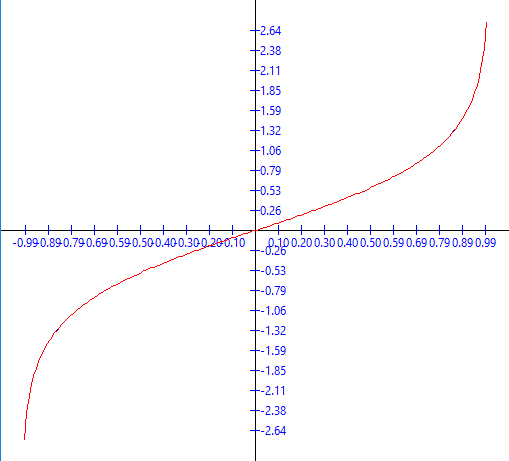
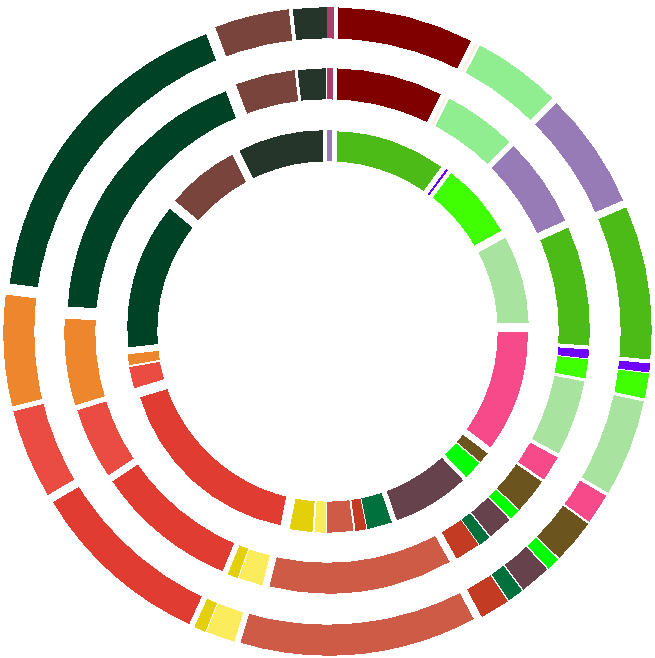
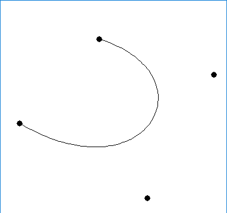
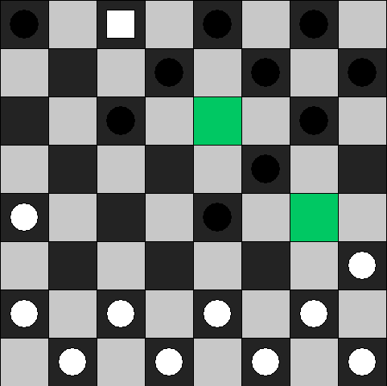

# Graphics

This repository contains assignments, implemented as part of the course **2D Computer Graphics**.

See explanatory markdown documents for each of the assignments in the `doc` folder. Assignments are all in *Romanian*.

> The markdown files use [tex math formulas, which won't show on github](https://stackoverflow.com/questions/11256433/how-to-show-math-equations-in-general-githubs-markdownnot-githubs-blog). To see formulas, you will either have to convert markdown to html or pdf, with [`MathJax`](https://www.mathjax.org/) enabled, or find the compiled pdf's [on my google drive](https://drive.google.com/drive/folders/1Rs0-qy6ivSDuHh5JadrP4Ta4YDhuVRiC).

PR's with grammar corrections, bug fixes, improvement suggestions or translations are very welcome.

Leave a star as a way to say "Thank you". Enjoy!


## Build instructions

1. `git clone https://github.com/AntonC9018/uni_graphics`
2. Install DMD from [here](https://dlang.org/download.html). Be sure to add D binaries in path (you'll be asked on installation).
3. To run a specific lab, do `dub run --config=labX`, where X is the number of the lab.

## Debugging

Also you can build and run in VSCode by hitting F5. 
- For this though you will need to install the [C/C++ extension](https://marketplace.visualstudio.com/items?itemName=ms-vscode.cpptools). 
- To be able to set breakpoints, enable the setting "Allow breakpoints everywhere".
- Configure which lab to build and run by editing `.vscode/settings.json`.


## Screenshots


```
dub --config=lab1
```




```
dub --config=lab2
```




```
dub --config=bezier_editor
```




```
dub --config=checkers
```

