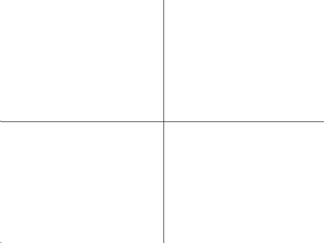
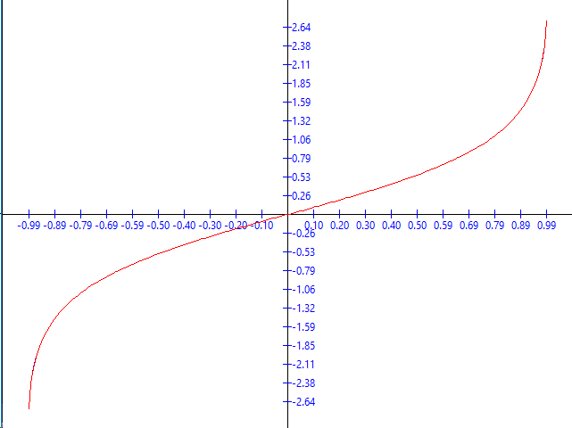

# Lucrarea de laborator Nr.1 la Grafica 2D pe calculator

A elaborat: **Curmanschii Anton, IA1901**.

Vedeți [Github](https://github.com/AntonC9018/uni_graphics)


## Sarcina

1. Este dată funcția $ f(x) = arctanh(x) $. De aproximat $ f(x) $ numeric cu precizia dată $ \epsilon $.
2. Să se creze un program ce desenează graficul funcției $ f(x) $ utilizând aproximarea numerică.
3. Să se deseneze $ f(x) $ utilizând funcția definită în librărie.
4. Să se scrie diferența dintre $ f(x) $ aproximată și cea din librărie într-un fișier, pentru fiecare x.
5. Să se scrie valorile funcției $ f(x) $ și x pentru fiecare x într-un fișier.
6. Să se verifice graficile cu un program extern.

## Realizarea

### Introducere

Am scris codul în limbajul de programare D care este foarte asemănător cu C, însă unele lucruri sunt mai utile și comode.

Așa că nu-mi trebuie multă funcționalitate pentru a desena graficuri (o fereastă grafică, linii pentru axele, text pentru valorile lui x și y), am decis să folosesc o librărie care tot este foarte simplă, [arsd.simpledisplay](https://dpldocs.info/experimental-docs/arsd.simpledisplay.html).

### 1. Aproximarea

Avem seria Maclaurin pentru $ arctanh(x) $ deja dată:

$$ arctanh(x) = \sum_{k = 1}^{\infty}{ \frac{ x^{2k - 1} }{ 2k - 1 }} = x + \frac{x^3}{3} + \frac{x^5}{5} + \ldots$$

Vom calcula funcția sumând fiecare termen aparte. 
Notez, că $ x^2 $ este înmulțit cu $ x^{n_{precedent}} $, de aceea, ca să nu calculăm $ x^{n_{nou}} $ din nou de fiecare dată, putem doar să calculăm $ x^{n_{nou}} = x^2 * x^{n_{precedent}} $. 
În codul de mai jos, eu pastrez acest termen nou în însăși variabila `x`.

Similar putem face cu numitorul, la care se adună 2 de fiecare dată.

Am scris un comentariu despre precizie și $ \epsilon $.
În cuvintele simple, pentru a verifica dacă aproximarea este destul de bună, nu este de ajuns de verificat dacă următorul termen este mai mic ca $ \epsilon $.
Pentru rezultatele bune aici am trebui să fac mai multă analiză referitor la modul cum eroarea depinde de următorul termen, dar îmi pare că aceasta nu este scopul lucrării.

Cum veți vedea pe urmă, aproximările nu sunt foarte bune pentru valori aproape de punctele terminale (-1, 1), din cauza că nu verific precizia strict matematic.


```d
float arctanh(float x, float epsilon)
{
	// It blows up to infinity at the endpoints.
	// I think it's not symmetric? 
	// I could do `x %= 1.0f` instead if it was though.
	if (x < -1 || x > 1) 
		return 0;

	float x_squared = x * x;
	float denumitor = 1;
	float dx = x;
	float y = 0;

	// We bail out when the dx becomes too small to change the value significantly.
	// Now, the thing it, this Maclaurin series converges pretty slowly, so this is wrong.
	// Getting into more advanced equations does not seems like the point of the assignment,
	// so I shall stop here.
	while (abs(dx) > epsilon)
	{
		y += dx;

		// x^(2k - 1) / (2k - 1)
		x *= x_squared;
		denumitor += 2;
		dx = x / denumitor;
	}
	return y;
}
```

### 2. Graficul

Voi evidenția numai cele mai importante momente.

Pentru a trasa graficul funcției, trebuie să calculăm valorile funcției în punctele consecutive, între punctele terminale. 
Vom uni aceste puncte consecutive cu linii, câte două.
Punctele terminale pentru funcția noastră sunt $ (-1, 1) $.

Deci, primul lucru este colectarea acestor puncte.

Pentru a reprezenta un vector (punct) floating point, am făcut o structură ajutătoare. 
Datorită sintaxei simple de operator overloading în D, cu 30 linii de code deja suportez toate operațiile aritmetice între doi vectori și între un vector și un număr.

Am făcut și o metoda care convertează vectorul într-un `Point`, `Point` fiind structura definită de librărie, care conține tot conține 2 coordonați, însă acelea sunt numeri întregi.

```d
struct v2
{
	float[2] arrayof;

	float x() const { return arrayof[0]; }
	float y() const { return arrayof[1]; }

	this(float x, float y)
	{
		arrayof[0] = x; 
		arrayof[1] = y;
	}

	Point point() const
	{
		return Point(cast(int) x, cast(int) y);
	}

	v2 opBinary(string op)(const v2 rhs) const
	{
		mixin(`return v2(x`, op, `rhs.x,y`, op, `rhs.y);`);
	}

	v2 opBinary(string op)(const float rhs) const
	{
		mixin(`return v2(x`, op, `rhs,y`, op, `rhs);`);
	}

	ref auto opIndex(size_t index)
	{
		return arrayof[index];
	}
}
```


Acum funcția `samplePoints()` care evaluează funcția dată într-un interval dat, cu un număr de estimări dat.
Funcția returnează un tablou dinamic (am făcut aici leneș, deoarece am putea să prealochez tabloul, deoarece știm lungimea apriori).

```d
v2[] samplePoints(float delegate(float) func, v2 rangeX, float numSamples)
{
	v2[] result;
	float step = (rangeX[1] - rangeX[0]) / numSamples;

	foreach (i; 0..numSamples)
	{
		float x = i * step + rangeX[0];
		result ~= v2(x, func(x)); 
	}

	result ~= v2(rangeX[1], func(rangeX[1]));

	return result;
}
```

Și apelez funcția la startul programului, astfel:

```d
v2 rangeX = v2(-0.99, 0.99);
int numSamples = 200;
float epsilon = 0.0001f;
const samples = samplePoints(a => arctanh(a, epsilon), rangeX, numSamples); 
```

Având aceasta, este timpul să desenăm graficul. 
În primul rând, desenăm liniile de coordonate centrate în mijlocul ecranului. (Originea nu ar fi necesar 0, depinde de funcție).

```d
painter.drawLine(Point(0, height / 2), Point(width, height / 2));
painter.drawLine(Point(width / 2, 0), Point(width / 2, height));
```



Acum vom desena *pips* — indicatorii distanțate uniform ce indică x și y. 
Codul este mai complicat. 
De fapt este un joc cu coordonatele funcției și coordonatele pe fereastă, normalizarea și centrarea lor.
Îl voi plasa și aici, dar nu aștept că îl veți înțelege. 
Numele variabilelor ar putea fi mai bune.

```d
Pen pen;
pen.width = 1;
pen.color = Color.blue;
pen.style = Pen.Style.Solid; 
painter.pen = pen;

auto maximumY = samples.fold!((a, el) => max(a, el.y))(-float.max);
auto minimumY = samples.fold!((a, el) => min(a, el.y))(float.max);
auto leeway = 0.1;

auto rangeY = v2(minimumY, maximumY);
auto origin = v2(rangeY[1] + rangeY[0], rangeX[1] + rangeX[0]) / 2;
// auto start = (v2(rangeX[0], rangeY[0]) - origin) * (1 + leeway) + origin;
auto end = (v2(rangeX[1], rangeY[1]) - origin.y) * (1 + leeway) + origin.y;

int numberOfpips = 10;
int pipHeight = 10;
int numberOfPipsPlus1 = numberOfpips + 1;
v2 offsetScreen = v2(screenCenter.x / numberOfPipsPlus1, screenCenter.y / numberOfPipsPlus1);
v2 halfSpace = end - origin;
v2 individualOffset = halfSpace / numberOfPipsPlus1;

foreach (i; -numberOfpips..numberOfpips + 1)
{
    if (i == 0) continue;
    v2 p = origin + individualOffset * i;
    Point screenPoint = (offsetScreen * i).point;
    import std.conv, std.format;
    {
      	// x pips
      	Point screenStart = Point(screenPoint.x, -pipHeight / 2) + screenCenter;
      	Point screenEnd = Point(screenPoint.x, pipHeight / 2) + screenCenter;
      	painter.drawLine(screenStart, screenEnd);
      	auto str = "%2.2f".format(p.x);
      	painter.drawText(screenEnd - Point(painter.textSize(str).width / 2, 0), str);
    }
    {
	    // y pips
	    Point screenStart = Point(-pipHeight / 2, -screenPoint.y) + screenCenter;
	    Point screenEnd = Point(pipHeight / 2, -screenPoint.y) + screenCenter;
	    painter.drawLine(screenStart, screenEnd);
	    auto str = "%2.2f".format(p.y);
	    painter.drawText(screenEnd - Point(0, painter.textSize(str).height / 2), str);
    }
}
```


Și acum desenarea graficului. 
Cum am menționat anterior, vom conecta punctele câte două cu linii.
Aici cel mai complicat moment este să calculăm coordonatele puctului pe fereastă având punctele în "spațiul funcției".

Funcția `getPoint()` face această transformare. Ea ia un punct din "spațiul funcției", îi inversează y-ul (`s * v2(1, -1)`), îl normalizează (`/ halfSpace`) pentru a primi offsetul de la 0 la 1 de la origine, și îl scalează la offsetul propriu de la centrul ferestrei (`* dimensions / 2`), pe urmă adaugă coordonatele centrului (`screenCenter +`).

```d
v2 dimensions() { return v2(width, height); }
void graph(const v2[] samples, ref ScreenPainter painter, v2 halfSpace) 
{
	auto getPoint(v2 s) { return screenCenter + (s * v2(1, -1) / halfSpace * dimensions / 2).point; }

	auto p0 = getPoint(samples[0]);
	foreach (s1; samples[1..$])
	{
		auto p1 = getPoint(s1);
		painter.drawLine(p0, p1);
		p0 = p1;
	}
}
```

Apelăm această funcție după ce am desenat axele:
```d
graph(samples, painter, halfSpace);
```


### 3. Graficul de referință

Aici nimic nou, utilizăm deja descrisă funcția `samplePoints()` pentru a funcție din librărie, și folosim deja descrisă `graph()` pentru a desena graficul:

```d
const referenceSamples = samplePoints(a => std.math.atanh(a), rangeX, numSamples);
// ...
pen.color = Color.red;
painter.pen = pen;
graph(referenceSamples, painter, halfSpace);
```



Funcția inițială a fost acoperită de funcția nouă, deci am aproximat-o corect.

### 4. Fișierul cu comparare

Trivial, scriem toate datele necesare într-un fișier csv:

```d
void writePointsComparisonCsv(string path, const v2[] samples, const v2[] referenceSamples, float epsilon)
{
	auto f = File(path, "w");
	f.writeln("x,y,reference_y,delta,epsilon");
	foreach (i, sample; samples)
	{
		f.writefln("%f,%f,%f,%f,%f", sample.x, sample.y, referenceSamples[i].y, abs(sample.y - referenceSamples[i].y), epsilon);
	}
	f.close();
}
// ...
writePointsComparisonCsv("atanh_comparison.csv", samples, referenceSamples, epsilon);
```

Aici vedem că diferența este mai mare decât $ \epsilon $, deoarece nu am condiția de oprire matematică corectă.
Cum $ sin(x) $ așa condiție simplă `while (abs(dx) > epsilon)` va lucra, deoarece avem factoriale în numitori, însă aici avem o serie aritmetică în numitori.

```
x,y,reference_y,delta,epsilon
-0.990000,-2.642694,-2.646653,0.003959,0.000100
-0.980100,-2.298060,-2.300092,0.002032,0.000100
-0.970200,-2.094270,-2.095691,0.001421,0.000100
...
```

Dacă schimb condiția la, de exemplu `while (abs(dx) > epsilon * epsilon)`, avem unele aproximări mai bune:

```
x,y,reference_y,delta,epsilon
-0.990000,-2.646650,-2.646653,0.000003,0.000100
-0.980100,-2.300093,-2.300092,0.000001,0.000100
-0.970200,-2.095690,-2.095691,0.000001,0.000100
...
```

### 5. Fișierul cu valorile

```d
void writePointCsv(string path, const v2[] samples)
{
	auto f = File(path, "w");
	f.writeln("x,y");
	foreach (sample; samples)
	{
		f.writefln("%f,%f", sample.x, sample.y);
	}
	f.close();
}
// ...
writePointCsv("atanh.csv", samples);
```

```
x,y
-0.990000,-2.642694
-0.980100,-2.298060
-0.970200,-2.094270
-0.960300,-1.948759
...
```

### 6. Program extern

Este de ajuns să cautăm pe Google graficul lui $ arctanh $ pentru a ne asigura că sunt de fapt egale.


Nu văd prea mult sens să mai descarc un program care posibil nici nu acceptă formatul csv de valori, etc. 