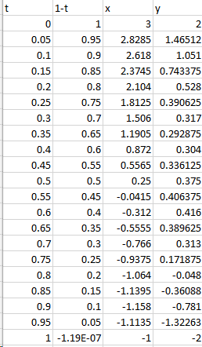
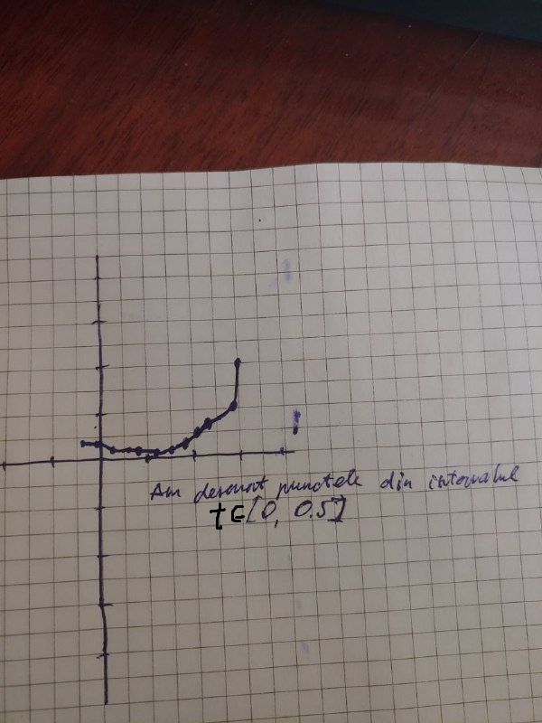
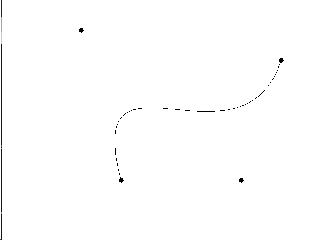

# Grafica pe calculator, Test 2

A realizat: **Curmanschii Anton, IA1901**.


> 1. Descrieţi ecuaţia parametrică a curbei Bezier pentru punctele de control date mai jos.
> **Punctele: P0(3, 2), P1(2, -2), P2(-2, 3), P3(-1, -2).**

Codul de mai jos scrie un fișier csv care conține punctele de pe curbă.

```d
import std.stdio;

void main()
{
    v2[4] points = [v2(3, 2), v2(2, -2), v2(-2, 3), v2(-1, -2)];
    import common.bezier : getBezierPoint;
    v2 p0 = points[0];
    writeln("t,1-t,x,y");
    for (float t = 0; t <= 1.01; t += 0.05)
    {
        v2 p1 = getBezierPoint(points, t);
        writeln(t, ",", 1 - t, ",", p1.x, ",", p1.y);
        p0 = p1;
    }
}
```




> 2. Desenaţi această curbă.



Același curbă desenată automat cu codul din 4.




> 3. În ce mod s-ar putea desena exact această curbă în editorul Adobe Illustrator?

Manual, aproximativ? Nu știu dacă este posibil de stabilit acest puncte exact manual în Adobe Illustrator.
Însă, el înțelege formatul svg. Svg este de fapt html lizibil de om. În acest svg putem defini punctele de control, sau să le schimbăm într-un svg existent. Adobe Illustrator după aceasta ar putea a le citi și a ne interpreta curba. 


> 4. Scrieţi în C++ fragmentul de funcţie void CAtestare1View::OnDraw(CDC* pDC) care desenează această curbă (utilizaţi PolyBezier()). 


```d
import arsd.simpledisplay;
import common.util;
import std.stdio;

void main()
{
	auto window = new SimpleWindow();
	v2 dimensions() { return v2(window.width, window.height); }

	window.eventLoop(1000 / 60, 
	{
		auto painter = window.draw();
		painter.clear();
		painter.outlineColor = Color.black;
		painter.fillColor = Color.black;

		v2[4] points = [v2(3, 2), v2(2, -2), v2(-2, 3), v2(-1, -2)];

        // Schimbați această valoare la false pentru a elimina oglindirea.
        bool mirrorY = true;
        if (mirrorY)
        {
            foreach (ref p; points)
                p.y = -p.y;
        }

		v2 start = v2(-4, -4);
		v2 end = v2(4, 4);
		v2 scaling = dimensions / (end - start);

		foreach (ref p; points)
			p = (p - start) * scaling;

		const pointWidth = 10;
		foreach (p; points)
			painter.drawCircle(p.point - pointWidth / 2, pointWidth);
		
        // Ecuația folosită în test 1
		import common.bezier : getBezierPoint;
		v2 p0 = points[0];
		for (float t = 0.01; t <= 1; t += 0.01)
		{
			v2 p1 = getBezierPoint(points, t);
			painter.drawLine(p0.point, p1.point); 
			p0 = p1;
		}
	});
}
```